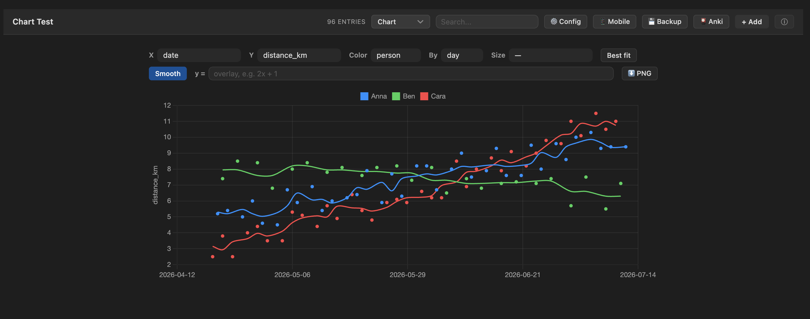
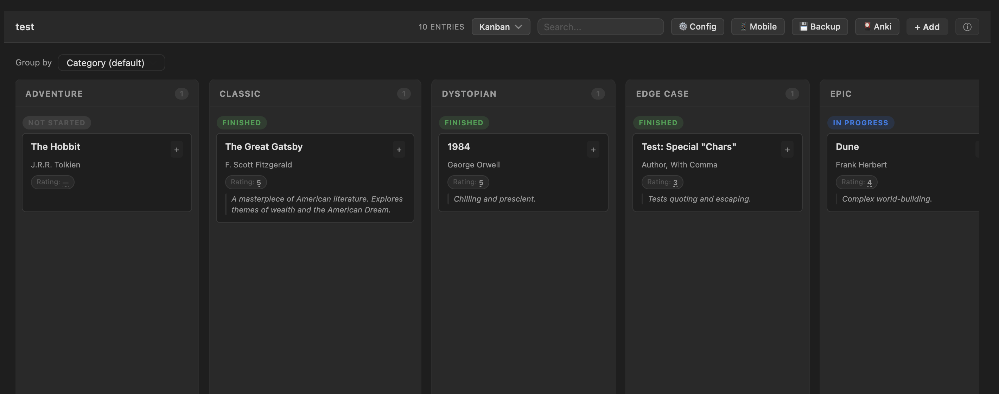
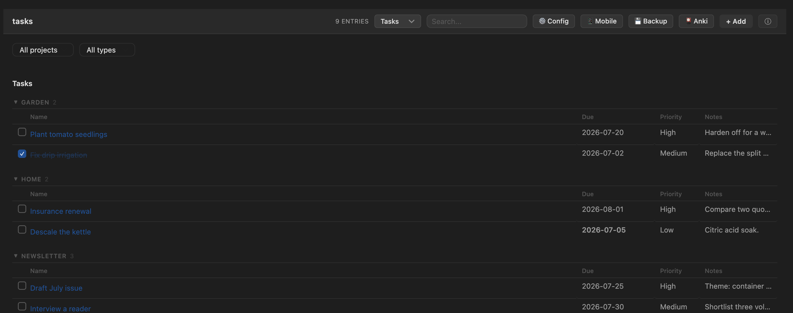
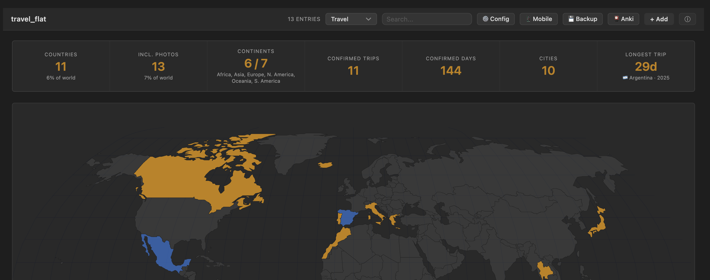
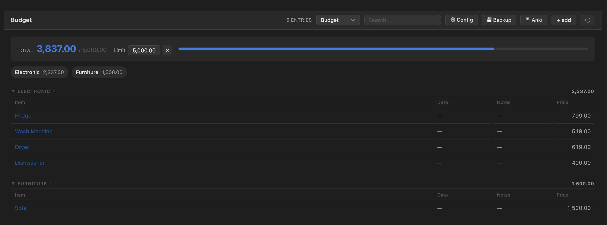

# DataDeck

**Your CSV files, alive inside Obsidian.** DataDeck opens plain `.csv` files
as rich, editable views — cards, kanban, an editable table, charts with
best-fit lines and formula overlays, a habit dashboard, a tasks board, a
budget tracker with per-category rollups against a spending limit, a
one-entry-at-a-time focus reader, and an interactive travel map. Everything
edits in place and writes straight back to the one canonical CSV file: no
database, no shadow copies, no lock-in. Your data stays a text file that
diffs, syncs, and outlives any tool.

<details open>
<summary><b>Screenshots</b> — chart, kanban, tasks board, budget tracker, and the travel map</summary>

<table>
<tr>
<td width="50%"></td>
<td width="50%"></td>
</tr>
<tr>
<td width="50%"></td>
<td width="50%"></td>
</tr>
<tr>
<td colspan="2"></td>
</tr>
</table>

</details>

## Highlights

- **Eleven view modes**, auto-offered based on the columns in the file — a
  books CSV gets a library, a habit log gets a dashboard, a tasks file gets
  a project board, an expenses CSV gets a budget tracker, a travel log gets
  a world map, a Start/End dated log gets a Gantt-lite timeline.
- **Everything is editable** — click a cell, toggle a habit, drag nothing:
  edits debounce-save back to the CSV. Notes-style columns render and edit
  as **Markdown**.
- **Charts** like a tiny ggplot: scatter/line of any column pair, color-by
  category (hue), size-by, per-series least-squares fits with R², `y = f(x)`
  formula overlays, week/month bucketing, rolling-average smoothing, bar
  aggregates for categorical axes, and one-click PNG export.
- **Embed blocks** put live views inside any note: `csv-view` (table /
  cards / kanban), `csv-chart`, `csv-tasks` (a cross-file tasks board),
  `csv-random` (quote of the day), and `csv-add` (a mobile-friendly entry
  form).
- **Sync-safe saves** — if the file changed on disk while you were editing
  (another device, another tab), the other version is stashed to `Archive/`
  instead of being silently overwritten.
- **Works on mobile.** Compact toolbars, one-scroll modals, touch-friendly
  pickers.

## Installation

Until DataDeck is in the community store:

- **Via [BRAT](https://github.com/TfTHacker/obsidian42-brat):** add
  `SVM0N/datadeck` as a beta plugin.
- **Manual:** grab `main.js`, `manifest.json`, `styles.css`, and
  `world-map.svg` from the latest
  [release](https://github.com/SVM0N/datadeck/releases) into
  `<vault>/.obsidian/plugins/datadeck/`, then enable **DataDeck** in
  Settings → Community plugins.

> `world-map.svg` is loaded at runtime for the travel view — include it when
> installing manually.

## Quick start

1. Open any `.csv` file — DataDeck takes over the tab and picks a sensible
   view from the columns it finds.
2. Switch views with the toolbar dropdown; **⚙ Config** sets per-file column
   roles (title, category, status, notes, image…), column types (checkbox /
   categorical / date), and the default view.
3. **+ Add** opens an entry form with the right control per column: dropdowns
   for categorical columns, a date picker for dates, toggles for 0/1 habit
   columns, a Markdown textarea for notes.
4. No CSV yet? Run a palette command: **Create tasks / travel / habit
   tracker / chart / timeline file** scaffolds one preconfigured for its view.

## View modes

The toolbar dropdown offers only the modes that make sense for the file's
columns:

| Mode | Appears when… | What it shows |
|------|---------------|---------------|
| **Table** | always | Editable spreadsheet: resizable columns, click-to-sort headers, sticky header |
| **Cards** | any groupable column | A library grouped by category — status dots, star ratings, tags, cover images, per-file sort |
| **Kanban** | any groupable column | Columns by category (or any column via "Group by" — year columns bucket into decades), status subgroups, inline note editing |
| **Chart** | a numeric column (2+ rows) | Scatter/line of any column pair with hue, size-by, fits, formulas, smoothing, bucketing, and bar aggregates — see [Charts](#charts) |
| **Dashboard** | a date column | Habit tracker: daily toggles, progress chart, streaks, per-habit GitHub-style calendars |
| **Tasks** | due/priority columns, or task-like type values | Project board: rows grouped by project, split into Tasks / Idea / Note sections, click-to-toggle done, overdue flags, filter by project / type / done-or-open |
| **Timeline** | a `Start` column plus an `End`/`Due` column | Gantt-lite horizontal timeline: one row per entry, drawn as an arrow spanning Start → End against a shared time axis; open-ended entries stretch to today, a dashed line marks "now", filter by category |
| **Budget** | a `Price`/`Cost`/`Amount`/`Total` column (or one assigned in ⚙ Config) | Items grouped by category with per-category subtotals and a grand total, set an inline spending limit and the total turns blue under it, red over |
| **Stats** | a category/status/rating/author column | Bar-chart insights: status breakdown, categories, rating histogram, entries per year — bars click through to the filtered library |
| **Focus** | any non-empty file | One entry at a time with big typography — built for quotes and vocabulary. ←/→ keys navigate |
| **Travel** | `country` + trip-date columns | World choropleth, trip timeline, per-country day totals, residency day-counters — see [Travel view](#travel-view) |

## Charts

Pick **Chart** in the toolbar (or embed a `csv-chart` block):

- **X / Y** — any numeric or date column; a date X renders a connected time
  series, numeric pairs render as scatter dots.
- **Color** — ggplot-style hue: one colored series per value of a
  categorical column.
- **Size** — a numeric column mapped to point radius (area-true sqrt scale).
- **Best fit** — per-series least-squares line with the equation and R²
  (phrased as an per-day trend for date axes).
- **Smooth** — a 7-day rolling average drawn over faint raw dots.
- **By week / month** — bucket a time series with a sum / avg / count
  aggregate ("km per week, one line per person").
- **Bar mode** — pick a *categorical* X and the chart becomes bars with a
  count / sum / avg aggregate; hue makes grouped bars; comma-separated
  columns (genres, tags) count once per value.
- **`y = f(x)` overlay** — type `2x^2 - 3x + 1` or `10 sin(x/2)`; parsed by
  a small built-in evaluator (`+ - * / % ^`, parentheses, implicit
  multiplication, `sin cos tan sqrt log ln exp abs floor ceil round min max
  pow`, `pi`/`e`). No `eval`.
- **⬇ PNG** — saves the chart as an image next to the CSV.

## Embed blocks

Live views inside any note. All paths resolve like links: a bare name is a
sibling of the note, `../` walks up, and anything else is vault-relative.

### `csv-view` — table / cards / kanban in a note

````
```csv-view
file: ../movies.csv
mode: kanban             ← table | cards | kanban   (default: table)
height: 480              ← optional max content height in px
collapse: Removed, Done  ← optional: card groups collapsed by default
```
````

Fully editable — inline cells, status chips, the entry expander, + Add, and
delete-with-undo all write back to the source CSV. Other open views of the
same file re-sync automatically.

### `csv-chart` — a chart (or pure function plot) in a note

````
```csv-chart
file: ../health.csv      ← omit for a formula-only plot
x: date                  ← default: date column, else first numeric
y: weight                ← default: first numeric column ≠ x
hue: person              ← optional color-by column
size: effort             ← optional numeric column → point radius
agg: sum                 ← aggregate for bar mode / bucket (count | sum | avg)
bucket: week             ← date X only: week | month buckets
smooth: true             ← date X only: rolling mean (true = 7 days, or a number)
fit: linear              ← best-fit line(s) with equation + R²
formula: 0.5x + 2        ← y = f(x) overlay; the whole plot when there's no file
xmin: -10                ← formula-only domain (default -10 … 10)
xmax: 10
height: 280
```
````

Read-only; re-renders when the source CSV changes.

### `csv-tasks` — a cross-file tasks board

````
```csv-tasks
folder: Projects         ← scan recursively for task-shaped CSVs ("/" = whole vault)
files: extra.csv         ← and/or an explicit comma-separated list
height: 600
```
````

Merges task rows from many CSVs into one board. Columns map onto a canonical
set (Title / Type / Project / Priority / Due / Status / Notes) by name
aliases — `deadline`, `state`, `kind`, `area`… all resolve. A file without a
Project column uses its **basename** as the project, so one-CSV-per-project
folders just work. Every edit writes back to the row's source file;
right-click a row for "Open source".

### `csv-random` — a random entry (quote of the day)

````
```csv-random
file: ../quotes.csv
field: Quote             ← optional; defaults to the first column
```
````

Re-rolls on every render and via its ↻ button — made for daily-note
templates.

### `csv-add` — an entry form in a note

````
```csv-add
file: ../habits.csv
```
````

A compact, grouped add/update form (date pre-filled with today, toggles for
habit columns, dropdowns with a custom escape hatch). On habit-tracker files
it pre-fills from the existing row for the picked date, so updating a day
never wipes what's already logged.

## Travel view

For a flat travel CSV with these columns:

```
date_entered,date_left,country,city,visa_status,notes,source,resolved
```

- `country` is ISO-2 (`US`, `FR`, …); `source` is `confirmed`, `inferred`
  (e.g. photo-derived), or `conflict`.
- Confirmed countries render gold; photo-only countries blue; conflict rows
  and photo rows overlapping a confirmed trip are excluded from counts.
- Click a country (map, table, or timeline) for a per-country trip panel.
- Blank/partial dates (`2022-06-??`) are allowed — visited-but-undated. A
  blank `date_left` counts as an ongoing stay ("📍 Currently in …").

### Residency counters

Configurable day-gauges (e.g. Schengen 90/180) render in the travel view.
Each rule counts *days in the listed countries within a window (calendar
year / rolling N days / all time), minus exempt visa rows, against a
threshold*. Add rules in **Settings → DataDeck → Residency rules**. These
are **indicators, not legal or tax advice**.

## Anki sync

The **🎴 Anki** toolbar button pushes rows to
[Anki](https://apps.ankiweb.net/) as flashcards — great for quotes and
vocabulary files. One Basic note per row: the front is the title column (or
your ⚙ Config pick), everything else joins onto the back. Decks are named
after the file and re-syncs skip cards that already exist, so it's safe to
click repeatedly.

Requires the [AnkiConnect](https://ankiweb.net/shared/info/2055492159)
add-on and the Anki desktop app running; desktop-only (it talks to
`http://127.0.0.1:8765`).

## Commands

- **Add entry to current CSV** — the + Add form, hotkey-able.
- **Cycle view mode** — steps through the file's valid views.
- **Create tasks / travel / habit tracker / chart / timeline file** — scaffold
  a new CSV preconfigured for that view.

## Privacy & network use

- All data stays in your vault. **No telemetry, no analytics, no network
  calls** — with one exception: the optional Anki sync button talks to
  AnkiConnect on `localhost` (`127.0.0.1:8765`) and only when you click it.
- Per-file settings live in the plugin's `data.json` inside your vault.

## Development

```bash
npm install
npm run build        # bundle main.ts → main.js (esbuild)
npm run dev          # watch build
npm run test:all     # unit + jsdom view-smoke tests (no Obsidian needed)
npm run typecheck    # tsc --noEmit
```

To deploy straight into your own vault while developing, point the plugin
at it once — `npm run deploy` copies the built assets into local symlinks
that you create (they're gitignored):

```bash
ln -s "<your-vault>/.obsidian/plugins/datadeck" datadeck
ln -s "<second-vault>/.obsidian/plugins/datadeck" datadeck-work   # optional
npm run build:deploy
```

Vault-touching dev tooling reads the `OBSIDIAN_VAULT` environment variable
for your vault's path (no default).

`main.ts` holds the `CardView` lifecycle and plugin entry point; each view
renderer and feature lives in `src/` as a free function taking the view —
the same functions power the full-page views and the embed blocks. Tests run
the renderers against a jsdom DOM with Obsidian's DOM helpers polyfilled
(`test-support/`); every view has smoke coverage.

See [docs/](docs/) for architecture, CSS-class, and dev-workflow notes.

## License

[MIT](LICENSE)
